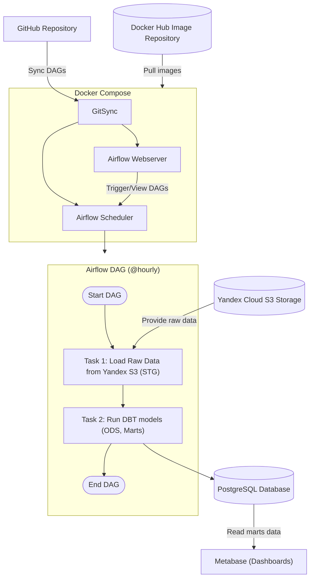
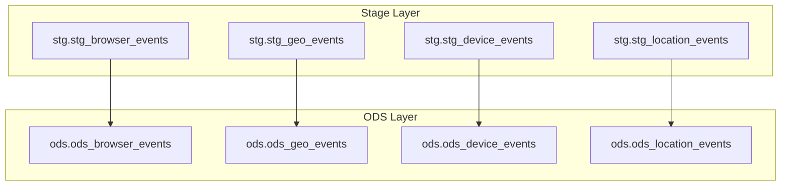

## Описание компонентов

- .github/workflows/docker-publish.yml — GitHub Actions workflow, который автоматизирует процесс построения Docker-образа и его публикации в Docker Hub.
- dags/ — Содержит файлы дагов для Apache Airflow, которые описывают задачи и зависимости для обработки данных.
- scripts/ — В этой папке находятся скрипты, которые выполняют различные этапы обработки данных (например, загрузка данных, их трансформация и т.д.).
- Dockerfile — Файл, который описывает, как строить контейнер для проекта, включая установку всех необходимых зависимостей.
- docker-compose.yml — Используется для запуска Airflow.


## Установка и настройка

### Требования

Для работы с проектом необходимо иметь установленные следующие инструменты:

- Docker
- Docker Compose
- GitHub (для использования CI/CD)

### Создай файл .env
Файл .env нужен для хранения переменных окружения, которые содержат секретную информацию.
1. Создай .env в корне проекта:
```bash
cp .env.example .env
```
2. Отредактируй .env под себя.

Важно: файл .env добавлен в .gitignire и не попадает в репозиторий. Каждый разработчик создаёт его локально. Вместо него в проекте есть .env.example - шаблон, который можно копировать.

## Работать в своей ветке

### Клонируй репозиторий

1. Убедись, что у тебя есть SSH-ключ
    1. Проверь наличие ключей:
        ```bash
        ls ~/.ssh/id_rsa.pub
        ```
    2. Если ключа нет - создай его:
        ```bash
        ssh-keygen -t rsa -b 4096 -C "your_email@example.com"
        ```
    (просто жми Enter на всех шагах)

2. Добавь публичный ключ в GitHub
    1. Скопируй ключ:
        ```bash
        cat ~/.ssh/id_rsa.pub
        ```
    2. Перейди в GitHub -> Settings -> SSH and GPG keys
    3. Нажми "New SSH key"
    4. Вставь ключ и нажми "Add SSH key"
3. Клонируй проект:
    ```bash
    git clone git@github.com:ArinaExpy/project_lab08.git
    cd project_lab08
    ```
4. (Опционально) Проверь, что всё работает
    ```bash
    ssh -T git@github.com
    ```

### Укажи имя своей ветки для Git Sync в .env
Было:
```
GIT_BRANCH=main
```
Стало:
```
GIT_BRANCH=feature/my-cool-change
```

### Запустить Airflow
После запуска Airflow будет подгружать DAG-и из GitHub (из твоей ветки) и показывать их в интерфейсе: https://localhost:8080
```bash
docker compose up --build -d
```

### Создай свою ветку
```bash
git checkout -b feature/my-cool-change
git push --set-upstream origin feature/my-cool-change
```
Важно: локальные изменения не попадут в Airflow, пока ты не запушишь их в Git!

# Схема Инфраструктуры



# Схема Базы данных 


