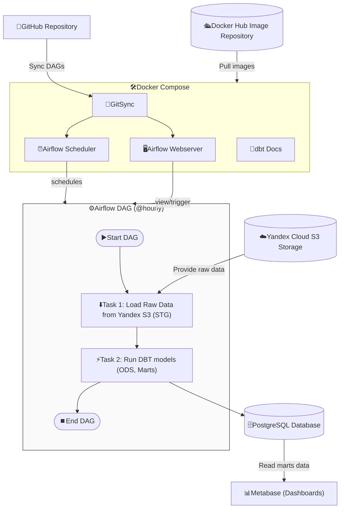

# End-to-End Data Engineering Project  
### Apache Airflow · dbt · PostgreSQL · Metabase · Docker

---

## 🧩 Overview

This project showcases a **modern end-to-end ELT (Extract–Load–Transform)** data pipeline built with:

- **Apache Airflow** – workflow orchestration and scheduling  
- **dbt (Data Build Tool)** – SQL-based data transformation and testing  
- **PostgreSQL** – data warehouse for raw and modeled data  
- **Metabase** – data visualization and dashboarding  
- **Docker Compose** – containerized, reproducible environment  

It demonstrates how raw data can be ingested, transformed, and visualized through a fully automated pipeline — a typical workflow used in real-world data-engineering projects.

> The original version ran on a cloud VM with S3-compatible storage (Yandex Object Storage).  
> For demonstration, it now uses a simplified local setup that can easily be adapted or extended.

---

## ⚙️ Architecture

