## Описание компонентов

- .github/workflows/docker-publish.yml — GitHub Actions workflow, который автоматизирует процесс построения Docker-образа и его публикации в Docker Hub.
- dags/ — Содержит файлы дагов для Apache Airflow, которые описывают задачи и зависимости для обработки данных.
- dbt/ - Используется для построения ODS/DM моделей в рамках DAG-а Airflow.
- scripts/ — В этой папке находятся скрипты, которые выполняют загрузку данных из источника Yandex.Cloud S3 Storage.
- .env.example - Template переменных окружения.
- Dockerfile — Файл, который описывает, как строить контейнер для проекта, включая установку всех необходимых зависимостей.
- docker-compose.yml — Используется для запуска Airflow.
- entrypoint.sh - Bash скрипт, используется в docker-compose.yml.
- requirements.txt - Хранит зависимости, используется в Dockerfile.


## Настройка

### Требования

Для работы с проектом необходимо иметь установленные следующие инструменты:

- Docker
- Docker Compose
- GitHub (для использования CI/CD)

### Создай файл .env
Файл .env нужен для хранения переменных окружения, которые содержат секретную информацию.
1. Создай .env в корне проекта:
```bash
cp .env.example .env
```
2. Отредактируй .env под себя.

Важно: файл .env добавлен в .gitignire и не попадает в репозиторий. Каждый разработчик создаёт его локально. Вместо него в проекте есть .env.example - шаблон, который можно копировать.

## Работать в своей ветке

### Клонируй репозиторий

1. Убедись, что у тебя есть SSH-ключ
    1. Проверь наличие ключей:
        ```bash
        ls ~/.ssh/id_rsa.pub
        ```
    2. Если ключа нет - создай его:
        ```bash
        ssh-keygen -t rsa -b 4096 -C "your_email@example.com"
        ```
    (просто жми Enter на всех шагах)

2. Добавь публичный ключ в GitHub
    1. Скопируй ключ:
        ```bash
        cat ~/.ssh/id_rsa.pub
        ```
    2. Перейди в GitHub -> Settings -> SSH and GPG keys
    3. Нажми "New SSH key"
    4. Вставь ключ и нажми "Add SSH key"
3. Клонируй проект:
    ```bash
    git clone git@github.com:ArinaExpy/project_lab08.git
    cd project_lab08
    ```
4. (Опционально) Проверь, что всё работает
    ```bash
    ssh -T git@github.com
    ```

### Укажи имя своей ветки для Git Sync в .env
Было:
```
GIT_BRANCH=main
```
Стало:
```
GIT_BRANCH=feature/my-cool-change
```

### Запустить Airflow
После запуска Airflow будет подгружать DAG-и из GitHub (из твоей ветки) и показывать их в интерфейсе: https://localhost:8080
```bash
docker compose up --build -d
```

### Создай свою ветку
```bash
git checkout -b feature/my-cool-change
git push --set-upstream origin feature/my-cool-change
```
Важно: локальные изменения не попадут в Airflow, пока ты не запушишь их в Git!

# Схема Инфраструктуры TD

```mermaid
flowchart TD
    DockerHub[(🛳️Docker Hub Image Repository)] -->|Pull images| DockerCompose
    GitHub["📂GitHub Repository"] -->|Sync DAGs| GitSync

    subgraph DockerCompose["🛠️Docker Compose"]
        Webserver[🖥️Airflow Webserver]
        Scheduler[⏰Airflow Scheduler]
        GitSync["🔄GitSync "]
    end

    GitSync --> Webserver
    GitSync --> Scheduler

    Scheduler --> DAG

    subgraph DAG["⚙️Airflow DAG (@hourly)"]
        direction LR
        DAGStart([▶️Start DAG]) --> Task1_LoadS3["⬇️Task 1: Load Raw Data from Yandex S3 (STG)"] --> Task2_DBT["⚡Task 2: Run DBT models (ODS, Marts)"] --> DAGEnd([⏹️End DAG])
    end

    YandexS3[(☁️Yandex Cloud S3 Storage)] -->|Provide raw data| Task1_LoadS3

    Task2_DBT --> PostgreSQL[(🗄️PostgreSQL Database)]

    Webserver -->|Trigger/View DAGs| Scheduler
    PostgreSQL -->|Read marts data| Metabase["📊Metabase (Dashboards)"]
```



# Схема Инфраструктуры LR

```mermaid
flowchart LR
    DockerHub[(🛳️ Docker Hub Image Repository)] -->|Pull images| DockerCompose
    GitHub["📂 GitHub Repository"] -->|Sync DAGs| GitSync

    subgraph DockerCompose["🛠️ Docker Compose"]
        Webserver[🖥️ Airflow Webserver]
        Scheduler[⏰ Airflow Scheduler]
        GitSync["🔄 GitSync"]
        DBTDocs
    end

    GitSync --> Webserver
    GitSync --> Scheduler

    Scheduler --> |schedules| DAG
    Webserver --> |view/trigger| DAG

    YandexS3[(☁️ Yandex Cloud S3 Storage)] -->|Provide raw data| Task1_LoadS3

    subgraph DAG["⚙️ Airflow DAG (@hourly)"]
        direction LR
        DAGStart([▶️ Start DAG]) --> Task1_LoadS3["⬇️ Task 1: Load Raw Data from Yandex S3 (STG)"] --> Task2_DBT["⚡ Task 2: Run DBT models (ODS, Marts)"] --> DAGEnd([⏹️ End DAG])
    end

    Task2_DBT --> PostgreSQL[(🗄️ PostgreSQL Database)]

    PostgreSQL -->|Read marts data| Metabase["📊 Metabase (Dashboards)"]

    style DAG fill:#f9f9f9,stroke:#333
```



# Документация Базы Данных 
http://217.16.20.100:8088/
